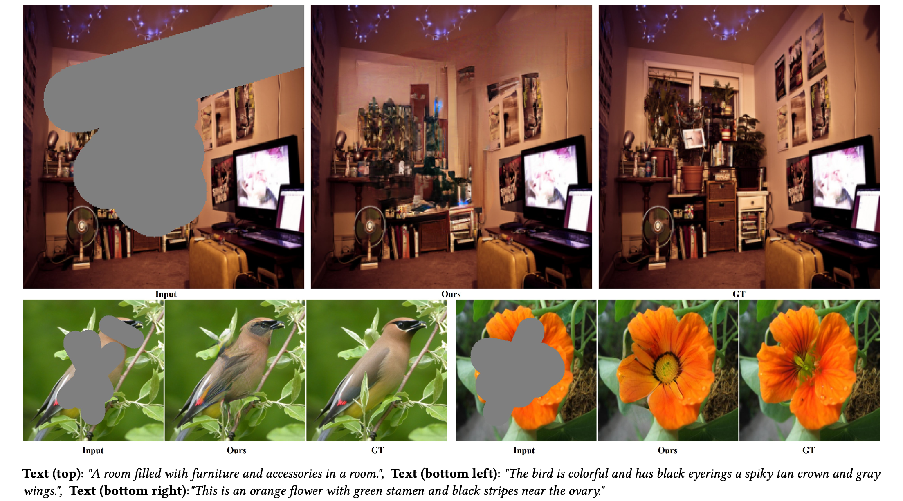

# DAFT-GAN

[**Project Page**](https://dual-affine-gan.github.io/daft-gan.github.io/) | [**Paper**](./assets/DAFT-GAN.pdf) | [**arXiv**](https://arxiv.org/abs/2408.04962)

[Jihoon Lee](None), [Yunhong Min](https://myh4832.github.io/), [Hwidong Kim](https://hdkim01.github.io/), [Sangtae Ahn](https://knu-brainai.github.io/)

# Introduction
This repository contains the official implementation of **DAFT-GAN**.   
DAFT-GAN is a novel framework for text-guided image inpainting. Compared to diffusion models, it demonstrates superior efficiency and speed while producing outputs with better fidelity.

# Environment setup

# Inference
